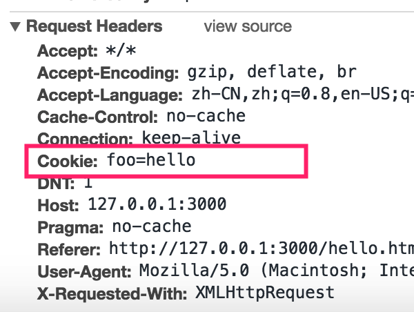

# cookie
  ```
    cookie	英[ˈkʊki]  美[ˈkʊki]  
    n.	饼干; 小甜点; 吸引人的年轻妇女; 甜面包;  
    [例句]She fed him a cookie  
    她给他吃了一块饼干。 
  ```
## cookie 是什么?
  > cookie 是存储于访问者的计算机中的变量。每当同一台计算机通过浏览器请求某个页面时(只要是发出请求就行)，就会发送这个 cookie。你可以使用 JavaScript 来创建和取回 cookie 的值。   
  这个变量只能保存字符串，这个变量所能存储的字符串的大小是4kb;
## cookie 有什么作用?
  - 例子: 保存用户名
    >当访问者(小明)首次访问页面时，再填写用户名之后，可以将名字存储于 cookie 中。当访问者再次访问网站时，他们会收到类似 "欢迎 小明！" 的欢迎词。而名字则是从 cookie 中取回的。
    
## cookie中会保存哪些信息?
  - cookie的名字
  - cookie的值
  - 到期时间
  - 所属域名（默认是当前域名）
  - 生效的路径（默认是当前网址

## 如何使用 cookie?
  > 在浏览器中cookie 这个变量其实指的是 `document.cookie`  

  - 1.存储一对cookie的名字和值  
    打开一个页面执行如下代码:  
      ```js
        document.cookie = 'foo=hello'
      ```
    这样当前页面就存储了一个cookie,名字为`foo`值为`hello`
    如果想修改这个名字为`foo`的cookie的值，只需要把hello修改下，重新执行上述代码就可以了，如下:  
      ```js
        document.cookie = 'foo=word'
      ```
    这样一来，名为`foo`的cookie的值就被修改为`word`了
  - 2.存储2对或者多对cookie的名字和值  
  如果想存储2对或者多对cookie的名字和值,则需要给`document.cookie 赋值2次或多次`, 如下:  
    ```js
      document.cookie = 'foo=hello'
      document.cookie = 'bar=nihao'
      document.cookie = 'hoge=xm'
    ```
    上面的代码执行之后,就会用三对cookie，通过`console.log(document.cookie)`可以查看这三对cookie的值为: `foo=hello; bar=nihao; hoge=xm`, 这三对cookie都被存储在document.cookie中, 并以分号(;) 分隔了

### cookie 的过期时间
  > 浏览器并没有提供直接用于删除cookie的方法, 所以无法通过调用某个方法来删除某个cookie
  > 但是浏览器允许我们给每个cookie设置一个时间, 当计算机的当前时间超过我们设置的这个时间时，浏览器会自动删除该cookie
 
  - 1.设置过期时间
   ```js
      // 设置一个当前时间之后100秒的时间
      var dt = new Date(Date.now() + (100 * 1000))
      // 将时间转换为格林时间
      var dtStr = dt.toGMTString()
      document.cookie = ‘foo=hello;expires=’ + dtStr
   ```
   执行之后, 就会有一个名为`foo`值为`hello`的cookie, 100秒之后这个cookie就会被浏览器删除。  
   如果在100秒之内就想删除这个cookie, 只需要把上述代码中的100改变为0重新执行一下就可以了, 也就是把过期时间设置当前时间或者之前的时间就可以了。代码如下:

   ```js
     // 这里的cookie的值, 不需要和之前一样，随便写个就可以了!
     document.cookie = 'foo=hello;expires=' + new Date().toGMTString()
   ```

### cookie 的所属域名
  > 我们在保存一个cookie时，除了会设置cookie的名字、过期时间外，浏览器还是自动帮我们添加上设置这个cookie时的页面的域名。
  > 当我们发请求时，浏览器会cookie中所属域名和请求地址中域名一样的的cookie全部发给服务器, 这些发给服务器的cookie是被浏览器添加到名为`Cookie`的请求头中发给服务器的。  
  

### cookie 的生效路径
  > 一个cookie,除也有名字、值、过期时间、所属域名、之外，还有生效路径(path)  
  *这里的设置cookie的页面所在的【父级路径】就是【生效路径】的默认值*
  *只能页面的【父级路径】和cookie的【生效路径】相同时或者是它的子级时，才能获取到这个cookie的值*
  > 如果两个页面对应的父级路径(path)相同，则共享同一个`document.cookie`  
  > 如果a页面的生效路径是b页面生效路径的子级路径，a页面的`document.cookie`会包含了页面的`document.cookie`值
  - 举个例子: 
   > a页面 对应的地址是: http://www.baidu.com/home/tmp/a.html  
   > b页面 对应的地址是: http://www.baidu.com/home/tmp/b.html
   > c页面 对应的地址是: http://www.baidu.com/home/test/c.htm
   > d页面 对应的地址是: http://www.baidu.com/home/d.html
   这里，a,b页面共享同一个`document.cookie`，因为a,b页页的生效路径相同。   
   d.html的生效路径是a,b,c的父级，所以a,b,c中的`document.cookie`都会包含d.html中的`document.cookie`的值  
  - 修改cookie的生效路径  
    *我们在设置cookie时是可以修改这个cookie的生效路径的*  
    代码如下:  
  ```js
      document.cookie = 'foo=hello;path=/'
      // 或者
      document.cookie = 'foo=hello;path=/home'
  ```

## 注意
  - 每个域名下cookie所能保存的内容只有4kb大小
  - 只能页面的【父级路径】和cookie的【生效路径】相同时或者是它的子级时，才能获取到这个cookie的值
  - cookie【生效路径】的默认值是设置该cookie时的页面的【父级路径】
  - 当我们每次发请求时，浏览器会cookie中所属域名和请求地址中域名一样的的cookie全部发给服务器

## 其他
### 存储单位进制
  > 1bit(位) === 8byte(字节)  
  > 1024byte === 1kb(千字节)  
  > 1024kb === 1mb(兆字节)  
  > 1024mb === 1gb(千兆字节)  
  > 1024gb === 1pb(拍字节)  
  > 1024pb === 1tb(太字节)  

### 格林时间与北京时间
  > 格林时间就是国际标准时间  
  > 格林天文台位于0度经线，北京时间采用东八度经线时间，北京时间比国际标准早8小时。  
  > 因此，国际标准时间+8=北京时间（若超过24，则结果减去24，同时日期加1.）
  ```js
    var dt = new Date()
    // 将时间转换为格林时间格式的字符串
    dt.toGMTString()
  ```